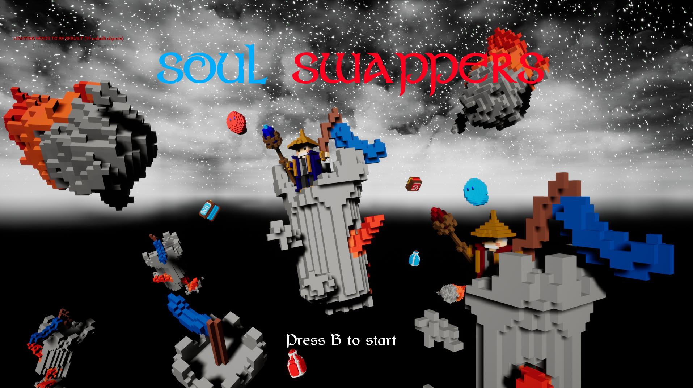
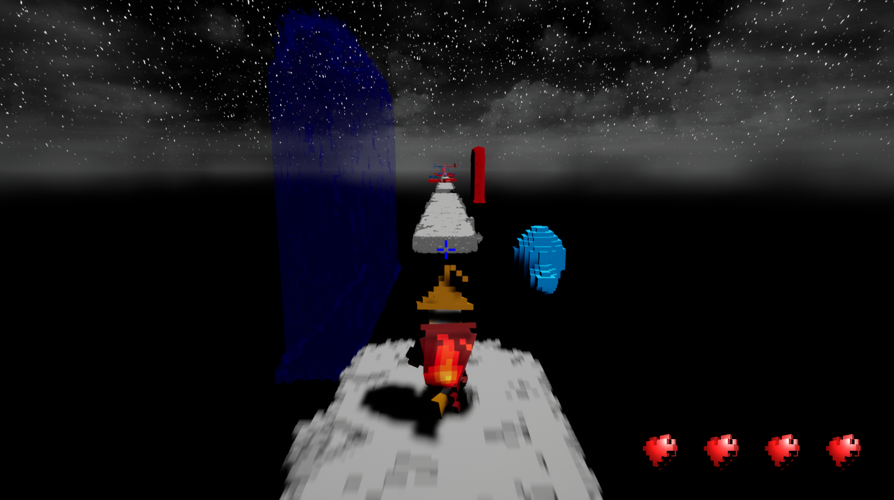
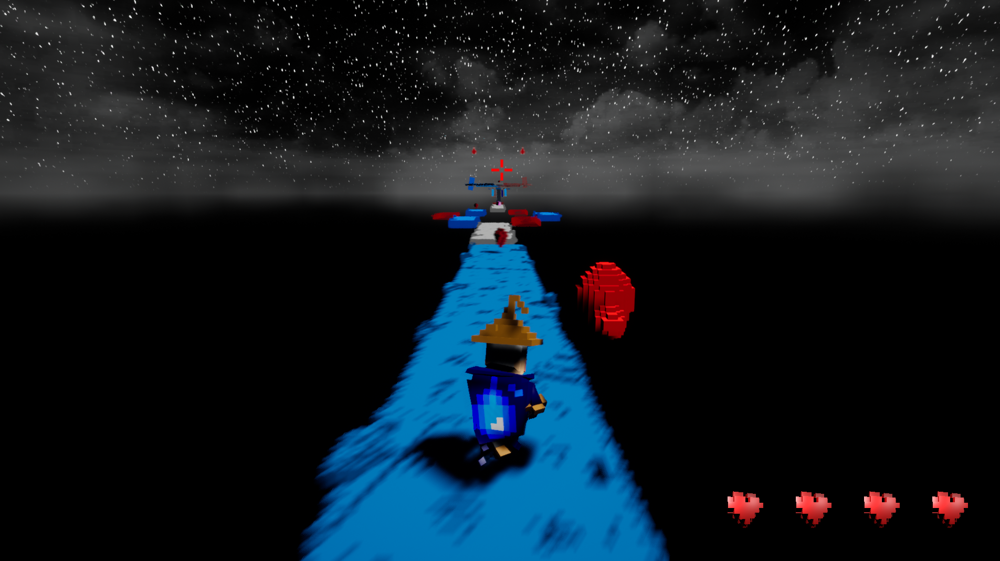
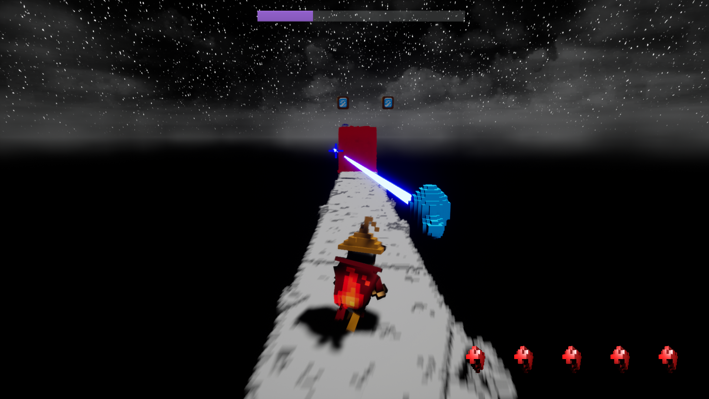
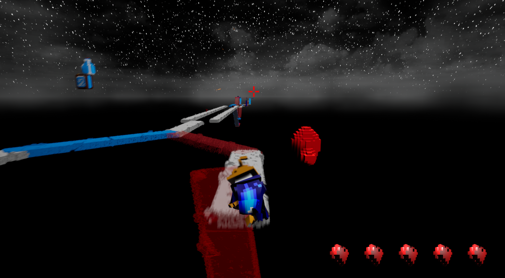

<h1> Soul Swappers </h1>

<h2><b>Introduction </b></h2>
Soul Swappers is a cooperative runner shooter on Switch and PC. You incarnate two wizard's souls who share the same body to reach the center of your destroyed tower. To achieve your goals, you should run through the debris of your old home and fight your old tools which came alive magically.

Soul Swappers is a project realized on Unreal Engine 4.27 mainly in C++. The project is designed for Nintendo Switch and PC. The people who took part in the project are Lenny Rabinne, Mateo Erbisti, Antoine Mordant, and Bryan Bachelet in Isart Digital.

Portfolio Link: https://merbistigp.editorx.io/portfolio-mateo/blank-3-3-1  
Itch.io Link : https://mateo-gp.itch.io/soul-swappers  

<h2><b> Controls :</b></h2>
<ul>
<li> For the wizard :
    <ul> 
    <li> Press A to jump
    <li> Hold A to wall run
    <li> Use the left joystick to move right or left
    <li> Start Button to set pause
    </ul>
<li> For the spirit :
    <ul>
        <li> Right Trigger to shoot
        <li> Left shoulder button to swap bodies
        <li> Start Button to set pause
    </ul>
</ul>

<h2><b> Gameplay :</b> </h2>

In a run, you control one of the two avatars: the runner and the shooter, respectively represented by the wizard and the spirit. Each player is assigned to a color. This color allows the magician to walk on the platforms with the same color and the spirit to shoot the enemies with the same color. You will have to change roles with your game partner between shooter and runner according to your environment. To reach the center of your blown-up home, you will have to communicate with your partner to be able to progress through the level.

The shooter has different weapons : 
<ul>
<li> Magical Beam
<li> Explosive Fireball
<li> Fire Rain
</ul>

<h2><b> Tasks I've worked on: </b> </h2>
• Asymmetrical local multiplayer implementation  
• Spirit's capacities: Shooting mechanic, Aim Assist (Really useful for the switch version because it was hard to aim well with joy-cons) 
• 3 different weapons: the Magical Beam (a laser that the player needs to charge during a certain amount of time), the Explosive Fireball (a rocket launcher that makes zone damage and can kill multiple enemies at the same time), and the Fire Rain (a weapon firing small fireballs at a fairly high rate) 
• 3D assets integration that we made in Voxel 
• Menus 
